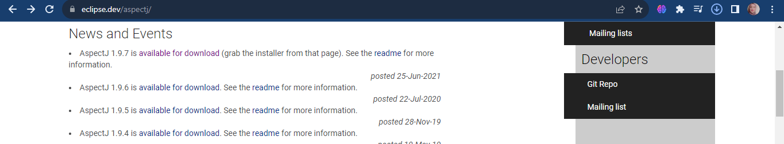
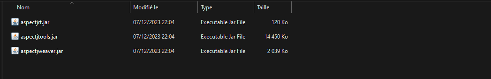
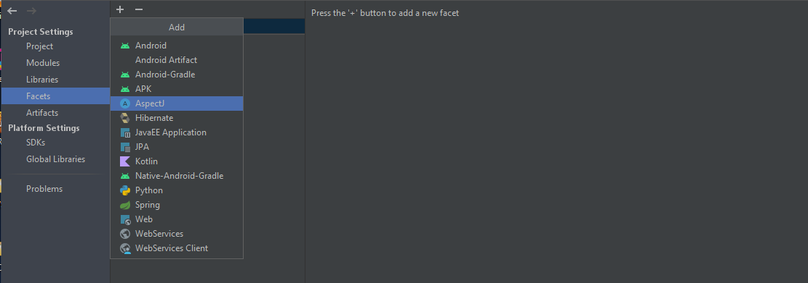
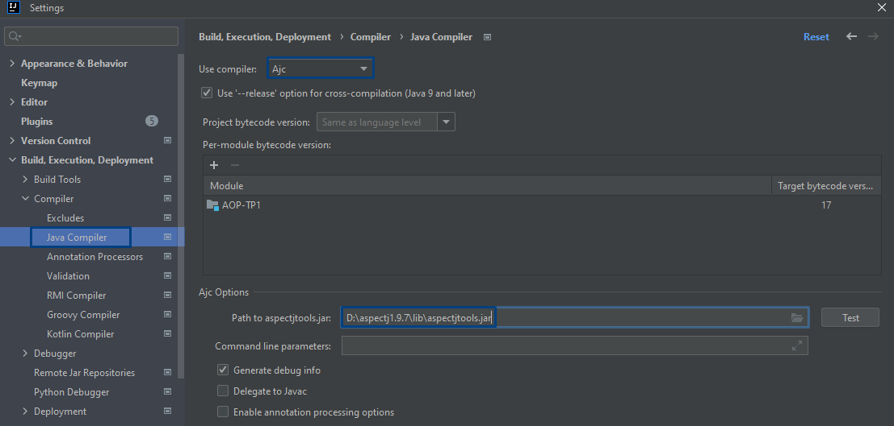
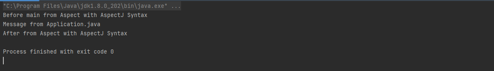
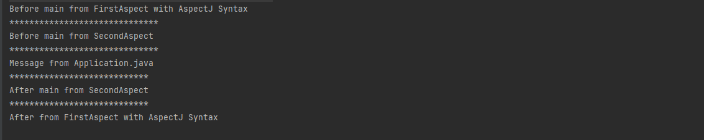

## Programmation Orientée Aspect (AOP) avec AspectJ 📚

La programmation orientée aspect est un paradigme de programmation qui permet de séparer les préoccupations transversales (logging, sécurité, transaction, etc.) des préoccupations fonctionnelles.

il existe deux types de tisseurs d'aspects :
- Tisseur d'aspects statique : les aspects sont tissés au moment de la compilation.
- Tisseur d'aspects dynamique : les aspects sont tissés au moment de l'exécution.

Dans cette activité, nous allons utiliser AspectJ et Spring AOP.


#### 1. Création du projet

Créez un projet Maven nommé `AOP-TP1-Using-AspectJ` avec les dépendances suivantes :


#### 2. Tisseur d'aspect

On va télécharger le tisseur d'aspect AspectJ à partir de ce lien : https://www.eclipse.org/downloads/download.php?file=/tools/aspectj/aspectj-1.9.6.jar





#### 3. Ajout des dépendances
```xml
<dependency>
    <groupId>org.aspectj</groupId>
    <artifactId>aspectjrt</artifactId>
    <version>1.9.6</version>
    <scope>runtime</scope>
</dependency>

```

#### 4. Ajout du facete AspectJ



#### 5. Spécification du compilateur AspectJ
File > Settings > Build, Execution, Deployment > Compiler > Java Compiler


#### 6. Création du point de coupe
```java
public aspect FirstAspect {
    
    pointcut pc1(): execution(* tests.Application.main(..));

    before(): pc1(){
        System.out.println("Before main from Aspect with AspectJ Syntax");
    }

    after(): pc1(){
        System.out.println("After from Aspect with AspectJ Syntax");
    }
    void around(): pc1(){
        System.out.println("Before main from Aspect with AspectJ Syntax");
        proceed();
        System.out.println("After from Aspect with AspectJ Syntax");
    }
}
```
Pour around, on utilise la méthode ***proceed()*** pour exécuter la méthode main().

#### 7. Exécution du programme


On constate que le point de coupe est bien exécuté avant et après l'exécution de la méthode main.

On va créer un autre aspect en se basant sur la syntaxe Class.
```java
@Aspect
public class SecondAspect {
    @Pointcut("execution(* ma.enset.tests.*.main(..))")
    public void pc1() {
    }

    @Before("pc1()")
    public void beforeMaine() {
        System.out.println("************");
        System.out.println("Before main");
        System.out.println("************");
    }

    @After("pc1()")
    public void afterMaine() {
        System.out.println("************");
        System.out.println("After main");
        System.out.println("************");
    }
}

```

On peut aussi utiliser la syntaxe ***@Around*** pour exécuter le code avant et après l'exécution de la méthode main.
```java
@Around("pc1()")
    public void aroundMaine(ProceedingJoinPoint proceedingJoinPoint) throws Throwable {
        System.out.println("******************************");
        System.out.println("Before main from SecondAspect");
        System.out.println("******************************");
        proceedingJoinPoint.proceed();
        System.out.println("****************************");
        System.out.println("After main from SecondAspect");
        System.out.println("****************************");
    }
    
```

#### 8. Exécution du programme
On constate que les deux aspects sont exécutés.


#### Conclusion 🌟 

Dans cette activité, on a utilisé le tisseur d'aspects AspectJ pour tisser des aspects avec deux syntaxes différentes : AspectJ et Class.


